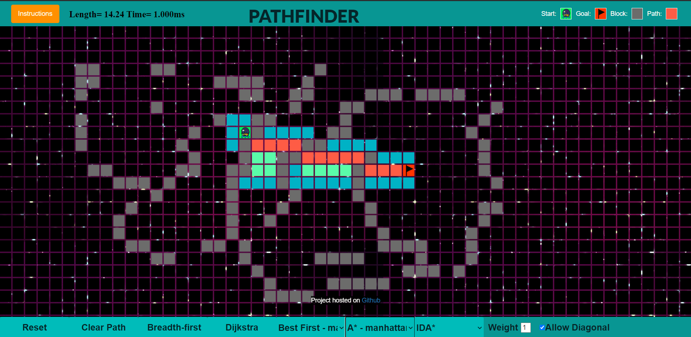
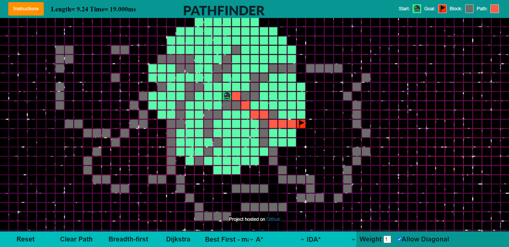
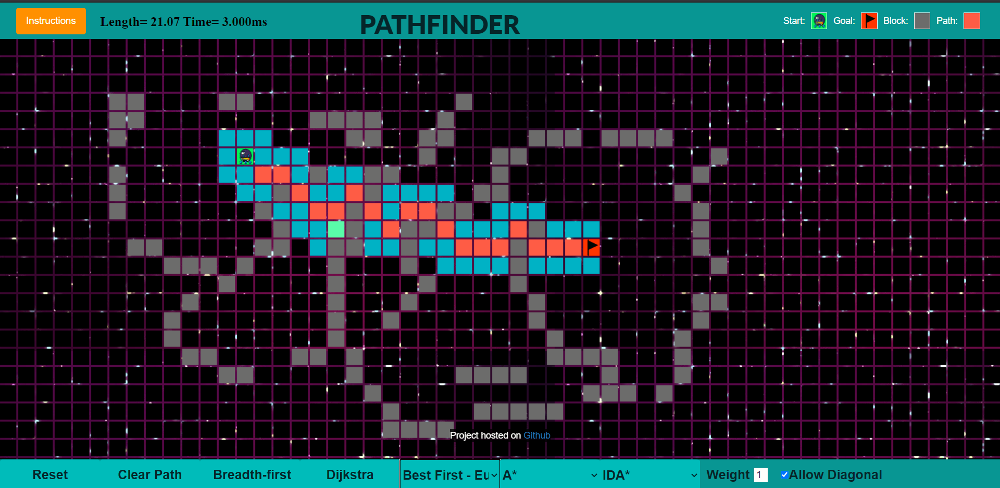

# Shortest Pathfinder
This project finds the shortest path between two points in 2D context. The algorithms which are being implemented in this project are the following:
- A*
- Dijkstra
- Best-First Search
- Breadth-first search
- IDA*

## Techstack:
Javascript ,HTML5 and CSS

## Project Link
https://shortest-path-git-master.ismians.vercel.app/maze/maze.html

The project works on all the browsers (Chrome, Microsoft edge, Mozilla Firefox(version 64.0 64bit), Safari(macOS Sierra)). 

## Images

- A* Algorithm

- Dijkstra Algorithm

- Best First Algorithm

## Limitations

- For some cases IDA* does not show any path due to the time limit exceed.
- If page doesn't load properly refresh it.  
- The project is working on 64.0 64bit version of Firefox. On other versions UI will be displayed well . Moreover , the algos will work well but problem can be faced in drawing obstacles(smoothness in drawing). 

